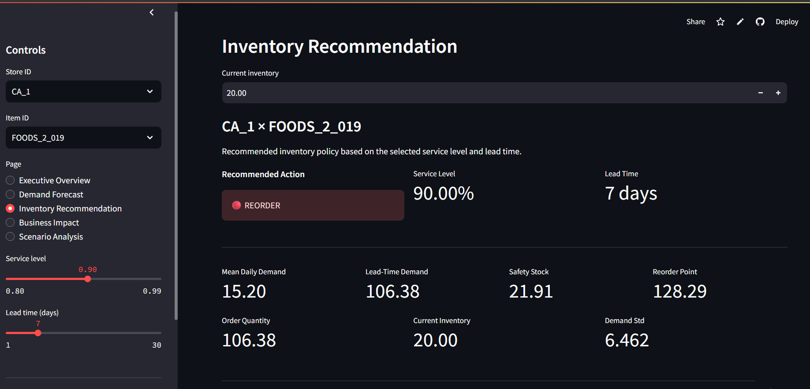
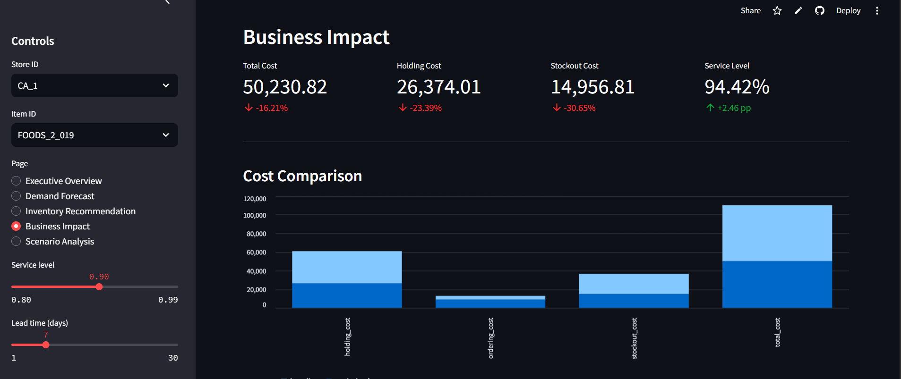
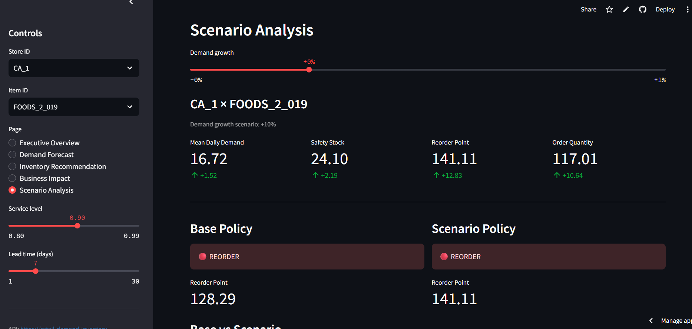
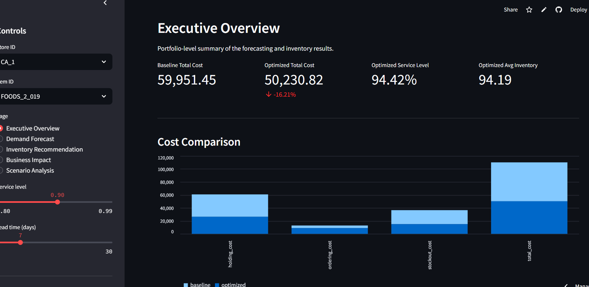

<div align="center">

# 📦 Retail Demand Forecasting & Inventory Optimization System

**An end-to-end, production-oriented Data Science / ML Engineering system for demand forecasting and cost-aware inventory control, built on the M5 Forecasting — Accuracy dataset.**

[](https://retail-demand-inventory-optimization-v1.streamlit.app/)
[](https://retail-demand-inventory-optimization.onrender.com/)
[]()
[]()
[]()

**[Live Dashboard](https://retail-demand-inventory-optimization-v1.streamlit.app/) · [API Docs](https://retail-demand-inventory-optimization.onrender.com/) · [Methodology](docs/methodology.md) · [Model Card](docs/model_card.md)**

</div>

---

## Overview

Retailers routinely face a joint problem: **demand is hard to forecast, and inventory policy decisions compound forecast error into real dollars** — through excess holding cost on one side and stockouts on the other. Most public forecasting portfolios stop at a leaderboard metric (RMSE, MAPE) and never connect the forecast to a decision.

This project closes that loop. It is a full, reproducible pipeline that goes from raw M5 retail data to a **deployed, cost-quantified inventory policy**, answering a concrete business question:

> **Given imperfect demand forecasts, what periodic-review inventory policy minimizes total cost (holding + ordering + stockout) while holding a target service level — and how much does a better forecast actually save?**

The system is deliberately **CPU-friendly and hardware-conscious**: it uses a deterministic, high-signal subset of the M5 panel so the entire pipeline — from feature engineering through gradient-boosted forecasting to inventory simulation — runs reproducibly on commodity hardware, without sacrificing methodological rigor.

```text
Raw retail data (M5)
        │
        ▼
Data validation & preparation
        │
        ▼
Exploratory demand analysis
        │
        ▼
Feature engineering
        │
        ▼
Time-based (leakage-safe) validation split
        │
        ▼
Baseline forecasting  (Naive / Seasonal Naive / Moving Average)
        │
        ▼
Gradient-boosted forecasting  (XGBoost / LightGBM)
        │
        ▼
Out-of-sample uncertainty estimation
        │
        ▼
Periodic-review (R, S) inventory optimization
        │
        ▼
Inventory simulation
        │
        ▼
Business-impact quantification
        │
        ▼
FastAPI inference service  →  Streamlit dashboard
```

---

## Why This Project Is Different

| Typical forecasting portfolio | This project |
|---|---|
| Optimizes a statistical error metric in isolation | Optimizes **total inventory cost**, using the forecast as an input to a decision |
| In-sample residuals for uncertainty | **Out-of-sample validation residuals**, avoiding optimistic uncertainty bands |
| Static notebook, no deployment | **Deployed FastAPI service + Streamlit dashboard**, decoupled via a versioned REST contract |
| Single train/test split | **Time-based validation → policy selection → held-out test evaluation**, mirroring real backtesting discipline |
| Ordering cost ignored | Ordering cost is **explicitly reported**, including its trade-off against holding/stockout cost |

---

## Dataset Characterization

Before modeling, the pipeline profiles the raw M5 panel to understand the demand-generating process, since intermittent demand invalidates naive use of MAE/RMSE alone.

| Metric | Result |
|---|---:|
| Historical units observed | ~65.70 million |
| Mean demand per item–store–day | 1.13 |
| Overall zero-demand rate | 68.20% |
| Median series zero-demand rate | 73.55% |
| Completely zero-demand series | 0 |
| Maximum single-day demand | 763 units |
| Total candidate series (full M5 panel) | 30,490 |
| Modeling subset (deterministic, high-signal) | 200 series |
| Prepared feature rows | 388,200 |

**Key implication:** demand is highly intermittent and right-skewed, with a small number of item–store series driving a disproportionate share of total volume (a classic Pareto pattern in retail SKU demand). This motivates:

- **WAPE as the primary evaluation metric** (robust to the near-zero and low-count regime where MAPE is undefined or explosive), with MAE/RMSE retained as secondary diagnostics.
- A **global forecasting model** (one model across series) rather than per-series models, to share statistical strength across sparse series — evaluated with segment-level breakdowns to confirm it doesn't just win on aggregate.

---

## Modeling Strategy

**Guiding principle:** *a machine-learning model must earn its complexity by beating a strong, honest baseline — not just an unconditional mean.*

Five models are benchmarked under an identical, leakage-safe, time-based validation protocol:

1. **Naive** (last observed value)
2. **Seasonal Naive** (7-day lag, capturing weekly retail seasonality)
3. **Moving Average**
4. **XGBoost** (gradient-boosted trees, engineered lag/rolling/calendar features)
5. **LightGBM** (histogram-based gradient boosting, same feature set)

### Validation Results

| Model | MAE | RMSE | WAPE |
|---|---:|---:|---:|
| **XGBoost** | **6.836** | **10.169** | **0.2808** |
| LightGBM | 6.895 | 10.309 | 0.2832 |
| Moving Average | 9.862 | 14.499 | 0.4051 |
| Seasonal Naive | 11.058 | 16.505 | 0.4542 |
| Naive | 16.732 | 24.879 | 0.6873 |

**XGBoost wins on every metric** and is selected as the production model. Notably, it improves WAPE by **59.2%** over the naive baseline and **38.2%** over seasonal naive — evidence that the engineered feature set (lags, rolling statistics, calendar/event signals) captures real structure beyond persistence and weekly seasonality, not just noise.

---

## Uncertainty Estimation

Prediction intervals are calibrated from **out-of-sample validation residuals**, not in-sample training error — training residuals systematically understate true forecast uncertainty because the model has already seen that data.

```text
n                = 5,600
MAE              = 6.836
RMSE             = 10.169
WAPE             = 0.2808
Validation period = 2016-03-28 → 2016-04-24
```

The residual standard deviation from this out-of-sample window parameterizes the demand-uncertainty distribution used downstream for safety-stock calculations — directly linking forecast quality to inventory policy, rather than treating them as separate exercises.

---

## Inventory Optimization

The inventory layer implements a genuine **periodic-review (R, S) policy** — not a simplified reorder-point heuristic — evaluated through discrete-event simulation.

### Policy Mechanics

```text
Inventory position = on-hand inventory + outstanding purchase orders

At each review point:
    if inventory position < S:
        order quantity = S − inventory position
        (clipped to [MOQ, max order quantity])

Protection period = lead time + review period
Safety stock      = f(service level, demand σ over protection period)
S                 = expected demand over protection period + safety stock
```

Candidate (R, S) policies are swept and scored on **validation-period total cost**, and only the selected policy is evaluated on the held-out test period — mirroring proper train/validate/test discipline rather than tuning on the evaluation set.

```text
Total Cost = Holding Cost + Ordering Cost + Stockout Cost
```

### Inventory Assumptions

| Parameter | Value |
|---|---:|
| Target service level | 90% |
| Lead time | 7 days |
| Review period | 7 days |
| Minimum order quantity | 5 units |
| Maximum order quantity | 500 units |
| Holding cost | 0.05 / unit / day |
| Ordering cost | 5.00 / order |
| Stockout cost | 2.00 / unit |
| Demand estimation window | 365 days |

*These are transparent, documented modeling assumptions (see [`docs/business_assumptions.md`](docs/business_assumptions.md)) intended for methodological demonstration — not calibrated retailer economics.*

---

## Business Impact Results

The optimized policy is benchmarked against a baseline policy on the **identical held-out test period**, isolating the effect of the optimization itself from any difference in evaluation window.

| Metric | Baseline | Optimized | Change |
|---|---:|---:|---:|
| Total cost | 59,951.45 | **50,230.82** | **−16.21%** |
| Holding cost | 34,425.33 | **26,374.01** | **−23.39%** |
| Ordering cost | 3,960.00 | 8,900.00 | +124.75% |
| Stockout cost | 21,566.12 | **14,956.81** | **−30.65%** |
| Average inventory | 122.95 | **94.19** | **−23.39%** |
| Stockout units | 10,783.06 | **7,478.41** | **−30.65%** |
| Stockout days | 390 | **342** | **−12.31%** |
| Service level | 91.96% | **94.42%** | **+2.46 pp** |
| Orders placed | 792 | 1,780 | +124.75% |

**Interpretation:** the optimized policy reduces total simulated cost by **16.21%** while *simultaneously* raising service level by **2.46 pp** and cutting stockout units by **30.65%** — i.e., it does not trade service for cost, it improves both. The mechanism is visible in the numbers: the policy chooses to **order more frequently, in smaller quantities** (+124.75% ordering cost), which reduces average on-hand inventory and stockout exposure enough to more than offset the added ordering cost. This trade-off is reported explicitly rather than netted out, so the "how" of the saving is auditable, not just the "how much."

---

## Live System

### Dashboard (Streamlit)

Five interactive views, all backed by the live FastAPI service — **no model training or raw-data processing happens client-side**:

| View | Purpose |
|---|---|
| **Executive Overview** | Portfolio-level KPIs and headline business impact |
| **Demand Forecast** | Forecast horizon, prediction intervals, model metadata, forecast table |
| **Inventory Recommendation** | Reorder decision, safety stock, reorder point, lead-time demand, order quantity |
| **Business Impact** | Baseline vs. optimized cost, inventory, stockout, and service-level comparison |
| **Scenario Analysis** | Stress-testing under hypothetical demand-growth scenarios |

**Executive Overview**


**Business Impact**


**Inventory Recommendation**


**Scenario Analysis**


> Screenshot files are expected at `docs/screenshots/` using the filenames shown above.

### API (FastAPI)

| Endpoint | Method | Purpose |
|---|---|---|
| `/health` | GET | Service liveness check |
| `/options` | GET | Available item/store series and configuration options |
| `/business` | GET | Precomputed business-impact metrics |
| `/forecast` | POST | On-demand demand forecast for a given series/horizon |
| `/inventory` | POST | Inventory recommendation (reorder point, safety stock, order quantity) |
| `/scenario` | POST | Scenario/stress-test analysis under demand shocks |

Interactive OpenAPI documentation is available at the root of the deployed API.

### Deployment Architecture

```text
                          GitHub (source of truth)
                                   │
                 ┌─────────────────┴─────────────────┐
                 ▼                                    ▼
         Render Web Service                   Streamlit Community Cloud
                 │                                    │
          FastAPI inference API                       │
        (serves pre-trained artifacts)                │
                 │                                    │
                 └──────────────── HTTP ───────────────┘
                        (API_BASE_URL)
```

```text
API_BASE_URL=https://retail-demand-inventory-optimization.onrender.com
```

The API and dashboard are independently deployable services connected only by a versioned HTTP contract — the dashboard has no coupling to the training pipeline, model artifacts, or raw data.

---

## Hardware-Conscious, Reproducible Design

The full M5 panel (30,490 series) is far larger than an interactive portfolio deployment requires. Rather than melting all series into one oversized modeling table, the pipeline selects a **deterministic, high-demand subset**, controlled entirely through configuration:

```yaml
# configs/data_config.yaml
Up to 20 items per store
Up to 200 total series
→ 388,200 prepared feature rows
```

This keeps the full pipeline — feature engineering, dual gradient-boosted training, uncertainty estimation, and inventory simulation — runnable end-to-end on CPU-only hardware in minutes, while remaining a faithful, extensible subset of the real problem (raising the series cap is a one-line config change).

Raw M5 data is intentionally excluded from version control (see below).

---

## Repository Structure

```text
retail-demand-inventory-optimization/
│
├── api/                       FastAPI application
│   ├── main.py
│   ├── routes/
│   ├── schemas/
│   └── services/
│
├── configs/                   Pipeline & experiment configuration (YAML)
│
├── dashboard/                 Streamlit application
│   └── app.py
│
├── data/
│   ├── raw/                   M5 source files (not committed)
│   ├── interim/                Intermediate transformations
│   └── processed/              Model-ready features & simulation outputs
│
├── docs/
│   ├── architecture.md
│   ├── business_assumptions.md
│   ├── data_dictionary.md
│   ├── inventory_methodology.md
│   ├── methodology.md
│   └── model_card.md
│
├── models/                    Serialized trained artifacts
│
├── notebooks/                 17 analysis-first notebooks (see below)
│
├── reports/
│   ├── figures/
│   └── tables/
│
├── scripts/                   CLI entry points for each pipeline stage
│
├── src/                       Reusable production logic
│   ├── business/
│   ├── data/
│   ├── features/
│   ├── forecasting/
│   ├── inventory/
│   ├── simulation/
│   ├── uncertainty/
│   └── utils/
│
└── tests/                     pytest suite
```

**Design principle:** notebooks are for analysis, exploration, and narrative; `src/` holds the reusable, tested production logic that the API and scripts actually import. This separation keeps the deployed service auditable and keeps experimentation unconstrained.

---

## Notebook Workflow

17 notebooks, intended to be run in order, each analysis-first with visualizations, diagnostics, and written interpretation:

```text
01  Business Problem & Data Understanding      10  LightGBM Forecasting
02  Data Ingestion & Validation                 11  Forecasting Model Comparison
03  Data Cleaning & Preparation                 12  Demand Uncertainty
04  Exploratory Data Analysis                   13  Inventory Optimization
05  Demand Pattern Analysis                     14  Inventory Simulation
06  Feature Engineering                         15  Business Impact Analysis
07  Time-Based Split                            16  Sensitivity Analysis
08  Baseline Forecasting                        17  Final Analysis & Recommendations
09  XGBoost Forecasting
```

---

## Getting Started

### Environment Setup (Windows PowerShell)

```powershell
python -m venv .venv
.venv\Scripts\activate
python -m pip install --upgrade pip
python -m pip install -r requirements.txt
```

For notebook development and the full data-science environment:

```powershell
python -m pip install -r requirements-dev.txt
```

### Raw Data Placement

Download the M5 Forecasting — Accuracy dataset and place the following files under `data/raw/`:

```text
sales_train_evaluation.csv
sales_train_validation.csv
calendar.csv
sell_prices.csv
sample_submission.csv
```

The pipeline validates the presence and schema of these files before processing.

### Run the Full Local Pipeline

```powershell
python -m scripts.prepare_data
python -m scripts.build_features
python -m scripts.train_models
python -m scripts.estimate_uncertainty
python -m scripts.run_inventory_simulation
python -m scripts.build_business_impact
pytest -q
```

### Deployment Artifacts

The deployed API consumes processed artifacts and trained models — it never touches the raw dataset at runtime:

```text
data/processed/forecast_features.parquet
data/processed/inventory_simulation.parquet
data/processed/optimized_policies.parquet
data/processed/series_options.json

models/forecasting/best_model.joblib
models/forecasting/xgboost.joblib
models/forecasting/validation_model.joblib
models/uncertainty/residual_stats.joblib
models/uncertainty/business_metrics.joblib
```

### Run Tests

```powershell
pytest -q
```

The suite covers data validation, feature transformations, forecasting baselines, inventory calculations, and periodic-review simulation behavior.

---

## Important Limitations

- The default experiment runs on a portfolio-scale subset (200 series), not the full 30,490-series M5 panel — the pipeline scales via configuration, but full-scale results are not reported here.
- Forecasting relies on processed historical context and conservative assumptions for future price/event information (these are not perfectly known at forecast time in production).
- The deployed API serves pre-trained artifacts; retraining is a local, offline process, not triggered by API traffic.
- Inventory costs and MOQ constraints are explicit, documented assumptions and should be replaced with retailer-specific economics before any operational use.
- Reported service levels and cost savings are results from this specific historical simulation, not guarantees of future performance.

---

## Reproducibility Principle

Experimentation and deployment are deliberately decoupled:

```text
Local machine
    │
    ▼
Train / validate / optimize
    │
    ▼
Persist versioned artifacts
    │
    ▼
Deploy stateless inference API
    │
    ▼
Interactive dashboard (consumes API only)
```

This keeps the deployed service small, stateless, and predictable, while the full data-science workflow — including every experiment, diagnostic, and design decision — remains preserved and inspectable in the repository.

---

## License

See [`LICENSE`](LICENSE).
